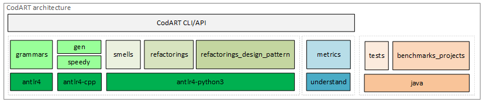

# CodART


Source Code Automated Refactoring Toolkit (CodART) is a refactoring engine with the ability to perform many-objective program transformation and optimization. We have currently focused on automating the [various refactoring operations](https://refactoring.com/catalog/) for Java source codes. A complete list of refactoring supported by CodART can be found at [CodART refactorings list](https://m-zakeri.github.io/CodART/refactorings_list/).

The CodART project is under active development. The current version of CodeART works fines on our benchmark projects. To understand how CodART works, read the [CodART white-paper](https://m-zakeri.github.io/CodART). 
Your contributions to the project and your comments in the discussion section would be welcomed. 
Also, feel free to email and ask any question: 
`m-zakeri[at]live[dot]com`.


## Getting started

### Researchers and end users
Researchers may use CodART search-based refactoring to reproduce the results of quality optimization on benchmark projects.


0. Clone the project source code!

1. Install `requirements.txt`.

2. Install [Sci-tools Understand](https://www.scitools.com). Make sure Understand API works fine (without error).

3. Add a `.env` file inside the root of the project and put the following settings:

```
PROJECT_ROOT_DIR="The root path for the projects"
CSV_ROOT_DIR="JDeodorant outputs csv paht for GodClass and Move class, Optional; only of WARM_START=1"
UDB_ROOT_DIR="The root path of the projects Understand databases"
INIT_POP_FILE="The path of initial population, Optional"
WARM_START=1
USE_CPP_BACKEND=0
EXPERIMENTER="Your name, Optional"
SCRIPT="Executed script, Optional"
DESCRIPTION="NSGA-III first run after major re-structuring!, Optional"
```

4. In `.env` file you also can determine the configuration of the search algorithm. The following is a default setting:

```
NGEN=10
RESUME_EXECUTION=""
BENCHMARK_INDEX=2
POPULATION_SIZE=15
MAX_ITERATIONS=15
LOWER_BAND=15
UPPER_BAND=50
PROBLEM=2
NUMBER_OBJECTIVES=8
MUTATION_PROBABILITY=0.2
CROSSOVER_PROBABILITY=0.8
```

* **Note 1:** `BENCHMARK_INDEX` denotes one of the projects in the list of the benchmark project. To see the list of benchmark projects, go to `codart.config.py`. The projects are listed in the `BENCHMARKS` dictionary.

* **Note 2:** The `PROBLEM` option can be set to one of these options: `0`: Simple genetic algorithm, `1`: NSGA-II, `3`: NSGA-III.

* **Note 3:** The `NUMBER_OBJECTIVES` option was not used for PROBLEM=0


5. Go to `codart.sbse` packages and run the `search_based_refactoring2.py` script.

* **Note 4**: According to your configuration and size of the projects, it may take several hours for the execution to be finished. 

* **Note 5:** The results of each execution, including generations, objective values, initial population, refactored program, etc., are saved besides the project path, already defined in `.env` file.


### Tool developers
Tool developers may want to use specific tools of the CodARTs.
We currently have provided a `setup.py` script that installs CodART on the system to be imported into other projects.


## CodART architecture
We discuss a summary of CodART architecture. The high-level architecture of CodART is shown in Figure 1. The source code consists of several Python packages and directories. We briefly describe each component in CodART. 



*Figure 1. CodART architecture*

### Repository structure

I. `grammars`: The directory contains three ANTLR v4 grammars for the Java programming language: 

1.	`Java9_v2.g4`: This grammar was used in the initial version of CodART. The main problem of this grammar is that parsing large source code files is performed very slow due to some decisions used in grammar design. We have switched to the fast grammar `JavaParserLabled.g4`.
      
2.	`JavaLexer.g4`: The lexer of Java fast grammar. This lexer is used for both fast parsers, i.e., `JavaParser.g4` and JavaParserLabeled.
      
3.	`JavaParser.g4`: The original parser of Java fast grammar. This parser is currently used in some refactoring. In the future release, this grammar will be replaced with `JavaPaseredLabled.g4`.
      
4.	`JavaParserLabeled.g4`: This file contains the same `JavaParsar.g4` grammar. The only difference is that the rules with more than one extension are labeled with a specific name. The ANTLR parser generator thus generates separate visitor and listener methods for each extension. This grammar facilitates the development of some refactoring. It is the preferred parser in CodART project.


II. `codart.gen`: The `codart.gen` packages contain all generated source code for the parser, lexer, visitor, and listener for different grammars available in the grammars' directory. To develop refactorings and code smells, `codart.gen.JavaLabled` package, which contains `JavaParserLabled.g4` generated source code, must be used. The content of this package is generated _automatically_, and therefore it should _not_ be modified _manually_. Modules within this gen package are just for importing and using in other modules.


III. `speedy`: The python implementation for ANTLR is less efficient than Java or C++ implementation. The `speedy` component implements a Java parser with a C++ back-end, improving the efficiency and speed of parsing. It uses speedy-antlr implementation with some minor changes.  The current version of the speedy module use `java9_v2.g4` grammar, which inherently slow as described. To switch to C++ back-end, first, the speedy module must be installed on the client system. It requires a C++ compiler. We _recommended_ to CodART developers using the Python back-end as switching to C++ back-end would be done transparently in the future release. The Python back-end saves debugging and developing time.


IV. `codart.refactorings`: The `codart.refactorings` package is the main package in the CodART project and contains numerous Python modules that form the kernel functionalities of CodART. Each module implements the automation of one refactoring operation according to standard practices. The modules may include several classes which _inherit_ from ANTLR listeners. Sub-packages in this module contain refactorings, which are in an early step of development or deprecated version of an existing refactoring. This package is under active development and testing. The module in the root packages can be used for testing purposes.


V. `codart.refactoring_design_patters`: The `codart.refactoring_design_pattern` package contain modules that implement refactoring to a specific design pattern automatically. 


VI. `codart.smells`: The `codart.smells` package implements the automatic detection of software code and design smells relevant to the refactoring operation supported by CodART. Each smell corresponds to one or more refactoring in the refactoring package.


VII. `codart.metrics`: The `codart.metrics` packages contain several modules that implement the computation of the most well-known source code metrics. These metrics used to detect code smells and measuring the quality of software in terms of quality attributed. 


VIII. `codart.sbse`: The `codart.sbse` packages include scripts that implement the search-based refactoring processes. It mainly uses Pymoo multi-objective framework to find the best sequence of refactoring operations to maximize the source code and design quality.


IX. `tests`: The test directory contains individual test data and test cases that are used for developing specific refactorings. Typically, each test case is a single Java file that contains one or more Java classes.


X. `benchmark_projects`: This directory contains several open-source Java projects formerly used in automated refactoring researches by many researchers. Once the implementation of refactoring is completed, it will be executed and tested on all projects in this benchmark to ensure the generalization of functionality proposed by the implementation.  

XI. **Other packages**: The information of other packages will be announced in the future.  
 
### Example to use cli for understand 
* to using understand

  *     --udb_path "/home/y/Desktop/desktop_0./CodART/benchmark_projects/JSON20201115/JSON20201115.und" --file_path "/home/y/Desktop/desktop_0./CodART/benchmark_projects/JSON20201115/src/main/java/org/json/JSONML.java" --source_class "JSONML"   --moved_methods "toJSONObject" --moved_fields "" --core 0 --project-path "/home/y/Desktop/desktop_0./CodART/benchmark_projects/JSON-java"

* to using openunderstand

  *     --udb_path "/home/y/Desktop/desktop_0./CodART/mydb.udb" --file_path "/home/y/Desktop/desktop_0./CodART/benchmark_projects/JSON20201115/src/main/java/org/json/JSONML.java" --source_class "JSONML"   --moved_methods "toJSONObject" --moved_fields "" --core 1 --project-path "/home/y/Desktop/desktop_0./CodART/benchmark_projects/JSON-java"


### News

**Summer 2022:** User instructions to install or running CodART were added. 

**Spring 2022:** Version [v0.2.3](https://github.com/m-zakeri/CodART/releases/tag/v0.2.3) was released. It works fine on the benchmark projects. 

**Spring 2021:** A milestone in development. First set of refactoring operation was released.

**Fall 2020:** CodART was started as a research project at [IUST reverse engineering laboratory](http://reverse.iust.ac.ir/).


### Read more

 * [CodART official website and documentation](https://m-zakeri.github.io/CodART)
 * [CodART refactoring list](https://m-zakeri.github.io/CodART/refactorings_list/)
 * [CodART code smells list](https://m-zakeri.github.io/CodART/code_smells_list/)
 * [CodART benchmark projects](https://m-zakeri.github.io/CodART/benchmarks/)
 * [CodART team members and contributors](https://m-zakeri.github.io/CodART/about/)
 * [CodART issues](https://github.com/m-zakeri/CodART/issues)


 * [Catalog of refactorings by Martin Fowler](https://refactoring.com/catalog/)
 * [Refactoring.Guru](https://refactoring.guru/)


Follow us!