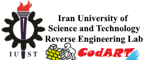

# CodART

Source Code Automated Refactoring Toolkit (CodART) is a research project at [IUST reverse engineering laboratory](http://reverse.iust.ac.ir/).
 
Project contributors: 

* Morteza ZAKERI, PhD student
* Ali Ayati, BSc student 
* Mina Tahaei, BSc student 

Read proposal:

 * [https://m-zakeri.github.io/CodART](https://m-zakeri.github.io/CodART)

