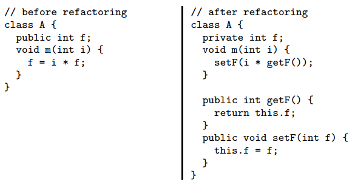

# Automated Source Code Refactoring Toolkit (CodART)

By: **Morteza Zakeri**†

† Ph.D. Student, Iran University of Science and Technology, Tehran, Iran (m-zakeri@live.com).

Version 0.1.0 (8 November 2020) ├ Download [PDF](./pdfs/project_proposal_v1z.pdf) version


**Abstract—** Software refactoring is performed by changing the software structure without modifying its external behavior. Many software quality attributes can be enhanced through the source code refactoring, such as reusability, flexibility, understandability, and testability. Refactoring engines are tools that automate the application of refactorings: first, the user chooses a refactoring to apply, then the engine checks if the transformation is safe, and if so, transforms the program. Refactoring engines are a key component of modern Integrated Development Environments (IDEs), and programmers rely on them to perform refactorings. In this project, an open-source software toolkit for refactoring Java source codes, namely CodART, will be developed. ANTLR parser generator is used to create and modify the program syntax-tree and produce the refactored version of the program. To the best of our knowledge, CodART is the first open-source refactoring toolkit based on ANTLR.
  
**Index Terms:** Software refactoring, refactoring engine, search-based refactoring, ANTLR, Java.

## 1 Introduction
**R**efactoring is a behavior-preserving program transformation that improves the design of a program. Refactoring engines are tools that automate the application of refactorings. The programmer need only select which refactoring to apply, and the engine will automatically check the *preconditions* and apply the transformations across the entire program if the preconditions are satisfied. Refactoring is gaining popularity, as evidenced by the inclusion of refactoring engines in modern IDEs such as [IntelliJ IDEA](https://www.jetbrains.com/idea/), [Eclipse](http://www.eclipse.org), or [NetBeans](http://www.netbeans.org) for Java.

Considering the *EncapsulateField* refactoring as an illustrative example. This refactoring replaces all references to a field with accesses through setter and getter methods. The *EncapsulateField* refactoring takes as input the name of the field to encapsulate and the names of the new getter and setter methods. It performs the following transformations:

* Creates a public getter method that returns the field's value, 
* Creates a public setter method that updates the field's value,
to a given parameter's value,
* Replaces all field reads with calls to the getter method,
* Replaces all field writes with calls to the setter method,
* Changes the field's access modifier to private.

The *EncapsulateField* refactoring checks several preconditions, including that the code does not already contain accessor methods and that these methods are applicable to the expressions in which the field appears. Figure 1 shows a sample program before and after encapsulating the field `f` into the ```getF``` and ```setF``` methods.



*Figure 1. Example EncapsulateField refactoring*

Refactoring engines must be reliable. A fault in a refactoring engine can silently introduce bugs in the refactored program and lead to challenging debugging sessions. If the original program compiles, but the refactored program does not, the refactoring is obviously incorrect and can be easily undone. However, if the refactoring engine erroneously produces a refactored program that compiles but does not preserve the semantics of the original program, this can have severe consequences. 

To perform refactoring correctly, the tool has to operate on the syntax tree of the code, not on the text. Manipulating the syntax tree is much more reliable to preserve what the code is doing. Refactoring is not just understanding and updating the syntax tree. The tool also needs to figure out how to rerender the code into text back in the editor view, called code transformation. All in all, implementing decent refactoring is a challenging programming exercise, required compiler knowledge. 

In this project, we want to develop CodART, a toolkit for applying a given refactoring on the source code and obtain the refactored code. To this aim, we will use ANTLR [1] to generate and modify the program syntax tree. CodART development consists of two phases: In the first phase, 42 common refactoring operations will be automated, and in the second phase, an algorithm to find the best sequence of refactorings to apply on a given software will be developed using many-objective search-based approaches.

Section 2 describes the refactoring operations in detail. Section 3 discusses the search-based refactoring and many-objective evolutionary algorithms. Section 4 explains the implementation phases, dataset, developers' team arrangement, and grading policy. Conclusion and future works are discussed in Section 5.

## 2 Refactoring operations

This section explains the refactoring operations used in the project. A catalog of 72 refactoring operations has been proposed by Fowler [2]. Each refactoring operation has a definition and is clearly specified by the entities in which it is involved and the role of each. Table 1 describes the desirable refactorings, which we aim to automate them. It worth noting that not all of these refactoring operations are introduced by Fowler [2]. A concrete example for most of the refactoring operations in the table is available at [https://refactoring.com/catalog/](https://refactoring.com/catalog/). Examples of other refactorings can be found at [https://refactoring.guru/refactoring/techniques](https://refactoring.guru/refactoring/techniques) and [https://sourcemaking.com/refactoring/refactorings](ttps://sourcemaking.com/refactoring/refactorings). 

*Table 1. Refactoring operations*

|     Refactoring                                      	|     Definition                                                                                                      	|     Entities                	|     Roles                                                 	|
|------------------------------------------------------	|---------------------------------------------------------------------------------------------------------------------	|-----------------------------	|-----------------------------------------------------------	|
|     Move   class                                     	|     Move   a class from a package to another                                                                        	|     package     class       	|     source   package, target package     moved   class    	|
|     Move   method                                    	|     Move   a method from a class to another.                                                                        	|     class     method        	|     source   class, target class     moved   method       	|
|     Merge   packages                                 	|     Merge   the elements of a set of packages in one of them                                                        	|     package                 	|     source   package, target package                      	|
|     Extract/Split   package                          	|     Add   a package to compose the elements of another package                                                      	|     package                 	|     source   package, target package                      	|
|     Extract   class                                  	|     Create   a new class and move fields and methods from the old class to the new one                              	|     class     method        	|     source   class, new class     moved   methods         	|
|     Extract method                                   	|     Extract a code fragment into a method                                                                           	|     method     statement    	|     source method, new method     moved statements        	|
|     Inline   class                                   	|     Move   all features of a class in another one and remove it                                                     	|     class                   	|     source   class, target class                          	|
|     Move   field                                     	|     Move   a field from a class to another                                                                          	|     class     field         	|     source   class, target class     field                	|
|     Push   down field                                	|     Move   a field of a superclass to a subclass                                                                    	|     class     field         	|     super   class, sub classes     move   field           	|
|     Push   down method                               	|     Move   a method of a superclass to a subclass                                                                   	|     class     method        	|     super   class, sub classes     moved   method         	|
|     Pull   up field                                  	|     Move   a field from subclasses to the superclass                                                                	|     class     field         	|     sub   classes, super class     moved   field          	|
|     Pull   up method                                 	|     Move   a method from subclasses to the superclass                                                               	|     class     method        	|     sub   classes, super class     moved   method         	|
|     Increase   field visibility                      	|     Increase   the visibility of a field from public to protected, protected to package or   package to private     	|                             	|                                                           	|
|     Decrease   field visibility                      	|     Decrease   the visibility of a field from private to package, package to protected or   protected to public     	|                             	|                                                           	|
|     Make   field final                               	|     Make   a non-final field final                                                                                  	|                             	|                                                           	|
|     Make   field non-final                           	|     Make   a final field non-final                                                                                  	|                             	|                                                           	|
|     Make   field static                              	|     Make   a non-static field static                                                                                	|                             	|                                                           	|
|     Make   field non-static                          	|     Make   a static field non-static                                                                                	|                             	|                                                           	|
|     Remove   field                                   	|     Remove   a field from a class                                                                                   	|                             	|                                                           	|
|     Increase   method visibility                     	|     Increase   the visibility of a method from public to protected, protected to package or   package to private    	|                             	|                                                           	|
|     Decrease   method visibility                     	|     Decrease   the visibility of a method from private to package, package to protected or   protected to public    	|                             	|                                                           	|
|     Make   method final                              	|     Make   a non-final method final                                                                                 	|                             	|                                                           	|
|     Make   method non-final                          	|     Make   a final method non-final                                                                                 	|                             	|                                                           	|
|     Make   method static                             	|     Make   a non-static method static                                                                               	|                             	|                                                           	|
|     Make   method non- static                        	|     Make   a static method non-static                                                                               	|                             	|                                                           	|
|     Remove   method                                  	|     Remove   a method from a class                                                                                  	|                             	|                                                           	|
|     Make   class-final                               	|     Make   a non-final class final                                                                                  	|                             	|                                                           	|
|     Make   class non-final                           	|     Make   a final class non-final                                                                                  	|                             	|                                                           	|
|     Make   class abstract                            	|     Change   a concrete class to abstract                                                                           	|                             	|                                                           	|
|     Make   class concrete                            	|     Change   an abstract class to concrete                                                                          	|                             	|                                                           	|
|     Extract   subclass                               	|     Create   a subclass for a set of features                                                                       	|                             	|                                                           	|
|     Extract   interface                              	|     Extract   methods of a class into an interface                                                                  	|                             	|                                                           	|
|     Inline   method                                  	|     Move   the body of a method into its callers and remove the method                                              	|                             	|                                                           	|
|     Collapse hierarchy                               	|     Merge a superclass and a subclass                                                                               	|                             	|                                                           	|
|     Remove control flag                              	|     Replace control flag with break                                                                                 	|                             	|                                                           	|
|     Replace nested conditional with guard clauses    	|     Replace nested conditional with guard clauses                                                                   	|                             	|                                                           	|
|     Replace constructor with factory function        	|     Replace constructor with factory function                                                                       	|                             	|                                                           	|
|     Replace exception with test                      	|     Replace exception with precheck                                                                                 	|                             	|                                                           	|
|     Rename field                                     	|     Rename a field                                                                                                  	|                             	|                                                           	|
|     Rename method                                    	|     Rename a method                                                                                                 	|                             	|                                                           	|
|     Rename class                                     	|     Rename a class                                                                                                  	|                             	|                                                           	|
|     Rename package                                   	|     Rename a package                                                                                                	|                             	|                                                           	|


## 3 Search-based refactoring

After refactoring operations were automated, we must decide which refactorings souled be performed in order to elevate software quality. The concern about using refactoring operations in Table 1 is whether each one of them has a positive impact on the refactored code quality or not. Finding the right sequence of refactorings to be applied in a software artifact is considered a challenging task since there is a wide range of refactorings. The ideal sequence is, therefore, must correlate to different quality attributes to be improved as a result of applying refactorings. 

Finding the best refactoring sequence is an optimization problem that can be solved by search techniques in the field known as Search-Based Software Engineering (SBSE) [3]. In this approach, refactorings are applied stochastically to the original software solution, and then the software is measured using a fitness function consisting of one or more software metrics. There are various metric suites available to measure characteristics like cohesion and coupling, but different metrics measure the software in different ways, and thus how they are applied will have a different effect on the outcome. 

The second phase of this project is to use a many-objective search algorithm to find the best sequence of refactoring on a given project. Recently, many-objective SBSE approach for refactoring [3]–[5] and remodularization, regrouping a set of classes C in terms of packages P, [6] has gained more attention due to its ability to find the best sequence of refactoring operations which is led to the improvement in software quality. Therefore, we first focus on implementing the proposed approach approaches in [3], [5], [6] as fundamental works in this area. Then, we will improve their approach. As a new contribution, we add new refactoring operations and new objective functions to improve the quality attribute of the software. We also evaluate our method on the new software projects which are not used in previous works.


## 4 Implementation

This section describes two phases of the project: Refactoring automation with ANTLR parser generator and refactoring recommendation through many-objective search-based refactoring.

### 4.1	Refactoring automation

Each refactoring operation in Table 1 is implemented as an API, with the refactoring name. The API receives the involved entities with their refactoring roles and other required data as inputs, checks the feasibility of the refactoring using refactoring preconditions described in [2], performs the refactoring if it is feasible, and returns the refactored code or return null if the refactoring is not feasible.

The core of our refactoring engine is a syntax-tree modification algorithm.  Fundamentally, ANTLR is used to generate and modify the syntax-tree of a given program. Each refactoring API is an ANTLR *Listener* or *visitor* class, which required argument by its constructor and preform refactoring when call by parse-tree walker object. The refactoring target and input parameters must read from a configuration file, which can be expressed in JSON, XML, or YAML formats.

The key to use ANTLR for refactoring tasks is the ```TokenStreamRewriter``` object that knows how to give altered views of a token stream without actually modifying the stream. It treats all of the manipulation methods as "instructions" and queues them up for lazy execution when traversing the token stream to render it back as text. The rewriter *executes* those instructions every time we call ```getText()```. This strategy is very effective for the general problem of source code instrumentation or refactoring. The ```TokenStreamRewriter``` is a powerful and extremely efficient means of manipulating a token stream.

### 4.2	Refactoring recommendation

A solution consists of a sequence of n refactoring operations applied to different code elements in the source code to fix. In order to represent a candidate solution (individual/chromosome), we use a vector-based representation. Each vector’s dimension represents a refactoring operation where the order of applying these refactoring operations corresponds to their positions in the vector. The initial population is generated by randomly assigning a sequence of refactorings to some code fragments. Each generated refactoring solution is executed on the software system *S*. Once all required data is computed, the solution is evaluated based on the quality of the resulting design.


### 4.3	Dataset

Refactorings are applied to software systems listed in Table 2. Datasets may change in the future. We use a set of well-known open-source Java projects that have been investigated in previous works and also add new Java software projects.

*Table 2. Software systems refactored in this project*

|     System            	|     Release                     	|     Previous releases    	|     Domain                                                       	|     Reference        	|
|-----------------------	|---------------------------------	|--------------------------	|------------------------------------------------------------------	|----------------------	|
|     [Xerces-J]            |     v2.7.0                        |                           |   software packages for parsing XML                             |   [3], [6]
|     [Azureus]             |     v2.3.0.6                      |                           |   Java BitTorrent client for handling multiple torrents         |     [3]             
|     [ArgoUML]             |     v0.26 and v0.3                |                           |   UML tool for object-oriented design                          	|     [3]               
|     [Apache Ant]        	|     v1.5.0 and v1.7.0           	|                          	|   Java build tool and library                                  	|     [3]              
|     [GanttProject]      	|     v1.10.2 and v1.11.1         	|                          	|   project management                                            |     [3], [6], [5]    
|     [JHotDraw]          	|     v6.1 and v6.0b1 and v5.3    	|                          	|   graphics tool                                                 |     [6], [5], [4]    
|     [JFreeChart]        	|     v1.0.9                      	|                          	|   chart tool                                                    |     [6]              
|     [Beaver]            	|     v0.9.11 and v0.9.8          	|                          	|   parser generator                                              |     [5], [4]         
|     [Apache XML-RPC]    	|     v3.1.1                      	|                          	|   B2B communications                                            |     [5], [4]         
|     [JRDF]              	|     v0.3.4.3                    	|                          	|   semantic web (resource management)                            |     [5]              
|     [XOM]               	|     v1.2.1                      	|                          	|   XML tool                                                      |     [5]              
|     [JSON]              	|     v1.1                        	|                          	|   software packages for parsing JSON                            |     [4]              
|     [JFlex]            	  |     v1.4.1                      	|                          	|   lexical analyzer generator                                    |     [4]              
|     [Mango]             	|     v                           	|                          	|                                                                 |     [4]              
|     [Weka]              	|     v3.9                        	|                          	|   data mining tool                                              |     New              
|     [ANTLR]             	|     v4.8.0                      	|                          	|   parser generator                                              |     New              


### 4.4 Agenda

Students must form groups of up to three persons, and each group must implement several refactoring operations. The exact list of refactoring will be assigned to each group subsequently. The refactoring operations in Table 1 may update during the semester. 

As an example of refactoring automation, we have implemented the EncapsulateField refactoring, illustrated in Figure 1. A naïve implementation is available on the project official Github page at [https://m-zakeri.github.io/CodART](https://m-zakeri.github.io/CodART). In addition, 26 refactoring operations in Table 1 have been implemented by [MultiRefactor](https://github.com/mmohan01/MultiRefactor) [7] based on [RECODER](http://sourceforge.net/projects/recoder), three of them have been implemented by JDeodrant [8], and other operations have been automated in  [3], [6]. RECODER extracts a model of the code that can be used to analyze and modify the code before the changes are applied and written to file. The tool takes Java source code as input and will output the modified source code to a specified folder. The input must be fully compilable and must be accompanied by any necessary library files as compressed jar files.

### 4.5	Grading policy

*Table 3. Grading policy*

Table 3 shows the grading policy. Grading policy may change in the future. 

|     Action                                        	|     Score   (100)          	|
|---------------------------------------------------	|----------------------------	|
|     Refactoring   operations implementation       	|     40                     	|
|     Search-based   refactoring recommendation     	|     30                     	|
|     Evaluation   of the tool on a real dataset    	|     20                     	|
|     Documentations                                	|     10                     	|
|     Improving   the state-of-the-arts papers      	|     30+   (extra bonus)    	|


# 5 Conclusion

Software refactoring is used to reduce the costs and risks of software evolution. Automated software refactoring tools can reduce risks caused by manual refactoring, improve efficiency, and reduce software refactoring difficulties. Researchers have made great efforts to research how to implement and improve automated software refactoring tools. However, the results of automated refactoring tools often deviate from the intentions of the implementer. The goal of this project is to propose an open-source refactoring engine and toolkit that can automatically find the best refactoring sequence required for a given software and apply this sequence. Since the tool is work based on compiler principles, it is reliable to be used in practice and has many benefits for software developer companies. Students who participate in the project will learn compiler techniques such as lexing, parsing, source code analysis, and source code transformation. They also learn about software refactoring, search-based software engineering, optimization, software quality, and object-orient metrics. 

### Conflict of interest
The project is supported by the (IUST Reverse Engineering Research Laboratory)[http://reverse.iust.ac.ir]. Interested students may continue working on this project to fulfill their final bachelor and master thesis or their internship.


## References

[1]	T. Parr and K. Fisher, “LL(*): the foundation of the ANTLR parser generator,” Proc. 32nd ACM SIGPLAN Conf. Program. Lang. Des. Implement., pp. 425–436, 2011.

[2]	M. K. B. Fowler, Refactoring: improving the design of existing code, Second Edi. Addison-Wesley, 2018.

[3]	M. W. Mkaouer, M. Kessentini, S. Bechikh, M. Ó Cinnéide, and K. Deb, “On the use of many quality attributes for software refactoring: a many-objective search-based software engineering approach,” Empir. Softw. Eng., vol. 21, no. 6, pp. 2503–2545, Dec. 2016.

[4]	M. Mohan, D. Greer, and P. McMullan, “Technical debt reduction using search based automated refactoring,” J. Syst. Softw., vol. 120, pp. 183–194, Oct. 2016.

[5]	M. Mohan and D. Greer, “Using a many-objective approach to investigate automated refactoring,” Inf. Softw. Technol., vol. 112, pp. 83–101, Aug. 2019.

[6]	W. Mkaouer et al., “Many-Objective Software Remodularization Using NSGA-III,” ACM Trans. Softw. Eng. Methodol., vol. 24, no. 3, pp. 1–45, May 2015.

[7]	M. Mohan and D. Greer, “MultiRefactor: automated refactoring to improve software quality,” 2017, pp. 556–572.

[8]	N. Tsantalis, T. Chaikalis, and A. Chatzigeorgiou, “Ten years of JDeodorant: lessons learned from the hunt for smells,” in 2018 IEEE 25th International Conference on Software Analysis, Evolution and Reengineering (SANER), 2018, pp. 4–14.


#### Related links

[IUST compiler course official webpage](http://parsa.iust.ac.ir/courses/compilers/)

ANTLR slides: PART 1: [Introduction](http://parsa.iust.ac.ir/download_center/courses_material/compilers/slides/ANTLR_part1_introduction.pdf)

ANTLR slides: PART 2: [Getting started in Java](http://parsa.iust.ac.ir/download_center/courses_material/compilers/slides/ANTLR_part2_getting_started_in_Java.pdf)

ANTLR slides: PART 3: [Getting started in C#](http://parsa.iust.ac.ir/download_center/courses_material/compilers/slides/ANTLR_part3_getting_started_in_CSharp.pdf)


#### Endnotes

[1] [https://www.jetbrains.com/idea/](https://www.jetbrains.com/idea/)

[2] [http://www.eclipse.org](http://www.eclipse.org)

[3] [http://www.netbeans.org](http://www.netbeans.org)

[4] [https://github.com/mmohan01/MultiRefactor](https://github.com/mmohan01/MultiRefactor) 

[5] [http://sourceforge.net/projects/recoder](http://sourceforge.net/projects/recoder) 

[6] [http://reverse.iust.ac.ir](http://reverse.iust.ac.ir) 

#### Download Project Links for Test
[Xerces-J](https://github.com/apache/xerces2-j)
[Azureus](https://github.com/vuze/vuze-remote-for-android)
[ArgoUML](https://github.com/argouml-tigris-org/argouml)                            
[Apache Ant](https://github.com/apache/ant)        	             
[GanttProject](https://github.com/bardsoftware/ganttproject)      	  
[JHotDraw](https://github.com/wumpz/jhotdraw)          	   
[JFreeChart](https://github.com/jfree/jfreechart)        	             
[Beaver](https://github.com/svn2github/beaver-parser-generator-v09)            	         
[Apache XML-RPC](https://ws.apache.org/xmlrpc/)   	        
[JRDF](http://jrdf.sourceforge.net/index.html)              	             
[XOM](https://github.com/elharo/xom)               	            
[JSON](https://github.com/stleary/JSON-java)              	             
[JFlex](https://github.com/jflex-de/jflex)            	              
[Mango](https://github.com/jfaster/mango)            	             
[Weka](https://github.com/ohmrefresh/Weka-Android-3.9.1-SNAPSHOT)              	           
[ANTLR](https://github.com/antlr/antlr4)             	            


#### FAQ
For any question please contact `m-zakeri@live.com`
