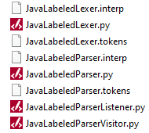
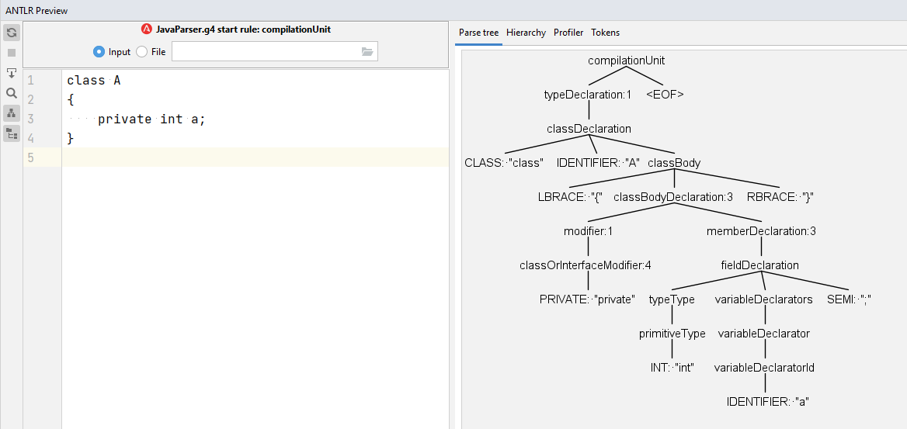

# ANTLR basic tutorials

By: Morteza Zakeri

Last update: April 30, 2022

## Introduction
The ANTLR tool generates a top-down parser from the grammar rules defined with the ANTLR meta-grammar (Parr and Fisher 2011). The initial version of ANTLR generated the target parser source code in Java. In the current version (version 4), the parser source code can be generated in a wide range of programming languages listed on the [ANTLR official website](https://www.antlr.org) (Parr 2022a). 
For simplicity, we generate the parser in Python 3, which provides us to run the tool on every platform having Python 3 installed on it. 
Another reason to use Python is that we can integrate the developed program easily with other libraries available in Python, such as machine learning and optimization libraries. 
Finally, I found that there is no comprehensive tutorial on using ANTLR with the Python backend. 

To use ANTLR in other programming languages, specifically Java and C#, refer to the ANTLR slides I created before this tutorial. 

The ANTLR tool is a small “.jar” file that must be run from the command line to generate the parser codes. The ANTLR tool jar file can be downloaded from [here](https://www.antlr.org/download/antlr-4.10.1-complete.jar). 

## Generating parser
As mentioned, to generate a parser for a programming language, the grammar specification described with ANTLR meta-grammar is required. ANTLR grammar files are named with the “.g4” suffix. 

We obtain the grammar of Java 8 to build our parser for the Java programming language. The grammar can be downloaded from ANTLR 4 grammar repository on GitHub: [https://github.com/antlr/grammars-v4]([https://github.com/antlr/grammars-v4). 
Once the ANTLR tool and required grammar files are prepared, we can generate the parser for that with the following command:

```commandline

> java -Xmx500M -cp antlr-4.9.3-complete.jar org.antlr.v4.Tool -Dlanguage=Python3 -o . JavaLexer.g4

> java -Xmx500M -cp antlr-4.9.3-complete.jar org.antlr.v4.Tool -Dlanguage=Python3 -visitor -listener -o . JavaLabeledParser.g4

```

The first command generates the lexer from the `JavaLexer.g4` description file and the second command generates the parser from the `JavaLabeledParser.g4` description file. It is worth noting that the lexer and parser can be written in one file. In such a case, a _single command_ generates all required codes in one step.

The grammar files used in the above command are also available in [grammars directory](../../grammars) of the CodART repository.
You may see that I have made some modifications to the Parser rules. 

In the above commands, the `antlr-4.9.3-complete.jar` is the ANTLR tool that requires Java to be executed. `-Dlanguage` denotes the destination language that the ANTLR parser (and lexer) source code is generated in which. In our case, we set it to Python3. 

After executing the ANTLR parser generation commands, eight files, including parser source code and other required information, are generated. Figure 1 shows the generated files. The “.py” contains lexer and parser source code that can parse any Java input file. The `-visitor -listener` switches in the second command result in generating two separate source files, `JavaLabledParserListener.py` and `JavaLabledParserVistor.py`, which provide interfaces to implement the required codes for a specific language application. Our application is source code refactoring which uses the listener mechanism to implement necessary actions transforming the program to the refactored version. 
The parse tree structure in and listener mechanism are discussed in the next sections.



_Figure 1. Generated files by ANTLR._

It should be noted that to use the generated classes in Figure 1, for developing a specific program, we need to install the appropriate ANTLR runtime library. For creating ANTLR-based programs in Python, the command `pip install antlr-python3-runtime` can be used. It installed all runtime dependencies required to program using the ANTLR library.

## ANTLR parse tree
The generated parser by ANTLR is responsible for parsing every Java source code file and generating the parse tree or designating the syntax errors in the input file. The parse tree for real-world programs with thousands of lines of code has a non-trivial structure. ANTLR developers have provided some IDE plugins that can visualize the parse tree to better understand the structure of the parse tree generated by ANTLR. We use Pycharm IDE developed by Jetbrains  to work with Python code. 

Figure 2 shows how we can install the ANTLR plugin in PyCharm. The plugin source code is available on the [GitHub repo](https://github.com/antlr/intellij-plugin-v4). When the plugin is installed, the ANTLR preview widow is applied at the bottom of the PyCharm IDE. In addition, the IDE can be recognized as “.g4” files and some other options added to the IDE. The main option is the ability to test a grammar rule and visualize the corresponding parse tree to that rule.


_Figure 2. Installing the ANTLR plugin in the PyCharm IDE._


In order to use the ANTLR preview tab, the ANTLR grammar should be opened in the PyCharm IDE. We then select a rule (typically the start rule) of our grammar, right-click on the rule, and select the “Test Rule `rule_name`” option from the opened menu, shown in Figure 3. We now write our sample input program in the left panel of the ANTLR preview, and the parse tree is shown in the right panel. 


_Figure 3. Test the grammar rule in the ANTLR PyCharm plugin._

Figure 4 shows a simple Java class and the corresponding parse tree generated by the ANTLR. The leaves of the parse tree are program tokens, while the intermediate nodes are grammar rules that the evaluating program is derived from them. Also, the root of the tree is the grammar rule, which we selected to start parsing. It means that we can select and test every rule independently. However, a complete Java program can only parse from the start rule of the given grammar, i.e., the `compilaionUnit` rule.



_Figure 4. Test the grammar rule in the ANTLR PyCharm plugin._


It should be mentioned that the ANTLR Preview window is based on a grammar interpreter, not on the actual generated parser described in the previous section. It means that grammar attributes such as actions and predicates will not be evaluated during live preview because the interpreter is language agnostic. For the same reasons, if the generated parser and/or lexer classes extend a custom implementation of the base parser/lexer classes, the custom code will not be run during the live preview. 

In addition to the parse tree visualization, the ANTLR plugin provides facilities such as profiling, code generation, etc., described in [here](https://github.com/antlr/intellij-plugin-v4) (Parr 2022b). For example, the profile tab shows the execution time of each rule in the parser for a given input string.

I want to emphasize that visualizing the parse tree with the ANTLR plugin is really helpful when developing code and fixing bugs described in the next section of this tutorial.


## Traversing the parse tree programmatically
ANTLR is not a simple parser generator. It provides a depth-first parse tree visiting and a callback mechanism called listener to implement the required program analysis or transformation passes. The depth-first search is performed by instantiating an object from the ANTLR `ParseTreeWalker` class and calling the walk method, which takes an instance of `ParseTree` as an input argument and traverses it.

Obviously, if we visit the parse tree with the depth-first search algorithm, all program tokens are visited in the same order that they appeared in the source code file. However, the depth-first search contains additional information about when a node in the tree is visited and when the visiting all nodes in its subtree is finished. Therefore, we can add the required actions when visiting a node to perform a special task. For example, according to Figure 4, for counting the number of classes in a code snippet, we can define a counter variable, initialize it to zero, and increase it whenever the walker visits the “classDeclartion” node. 


ANTLR provides two callback functions for each node in the parse tree. One is called by the walker when it is entered into a node, i.e., visit the node, but the children are not visited yet. Another is called when all nodes in the subtree of the visited node have been visited, and the walker is exiting the node. These callback functions are available in the listener class generated by the ANTLR for every rule in a given grammar. In our example for counting the number of classes, we implement all required logic in the body of `enterClassDeclartion` method of the `JavaLabledParserListener` class. We called these logic codes _grammar’s actions_ since, indeed, they are bunded to a grammar rule. 

It is worth noting that we can add these actions codes in the grammar file (`.g4` file) to form an attributed grammar. Embedding actions in grammar increase the efficiency of the analyzing process. However, when we need many complex actions, the listener mechanism provides a better way to implement them. Indeed, ANTLR 4 emphasizes separating the language applications from the language grammar by using the listener mechanism.

Listing 1 shows the implementation program for counting the number of classes using the ANTLR listener mechanism. The `DesignMetrics` class inherits from `JavaLabeledParserListener` class which is the default listener class generated by ANTLR. We only implement the `enterClassDeclartion` method, which increases the value of the `__dsc` counter each time the walker visits a Java class.


```Python
# module: JavaLabledParserListener.py

__version__ = "0.1.0"
__author__ = "Morteza"

from antlr4 import *
if __name__ is not None and "." in __name__:
    from .JavaLabeledParser import JavaLabeledParser
else:
    from JavaLabeledParser import JavaLabeledParser

class JavaLabeledParserListener(ParseTreeListener):
    # …
    def enterClassDeclaration(self,
                              ctx:JavaLabeledParser.ClassDeclarationContext):
        pass
    # …

class DesignMetrics(JavaLabeledParserListener):
    def __init__(self):
        self.__dsc:int = 0  # Keep design size in classes

    @property
    def get_design_size(self):
        return self.__dsc

    def enterClassDeclaration(self,
                              ctx:JavaLabeledParser.ClassDeclarationContext):
        self.__dsc += 1

```

_Listing 1: Programs that count the number of classes in a Java source code._


### Wiring the modules
To complete our simple analysis task, first, the parse tree for a given input should be constructed. Then, the DesignMetrics class should be instantiated and passed to an object of ParseTreeWalker class. We created a driver module in Python beside the generated code by ANTLR to connect different parts of our program and complete our task. Listing 2 shows the implementation of the main driver for a program that counts the number of classes in Java source codes.

```Python
# Module: main_driver.py

__version__ = "0.1.0"
__author__ = "Morteza"
from antlr4 import *
from JavaLabledLexer import JavaLabledLexer
from JavaLeabledParser import JavaLabledParser
from JavaLabledParserListener import DesignMetrics

def main(args):
    
    # Step 1: Load input source into the stream object
    stream = FileStream(args.file, encoding='utf8')
    
    # Step 2: Create an instance of AssignmentStLexer
    lexer = JavaLabledLexer(stream)
    
    # Step 3: Convert the input source into a list of tokens
    token_stream = CommonTokenStream(lexer)
    
    # Step 4: Create an instance of the AssignmentStParser
    parser = JavaLabledParser(token_stream)
    
    # Step 5: Create parse tree
    parse_tree = parser.compilationUnit()
    
    # Step 6: Create an instance of DesignMetrics listener class
    my_listener = DesignMetrics()
    
    # Step 7: Create a walker to traverse the parse tree and callback our listener
    walker = ParseTreeWalker()
    walker.walk(t=parse_tree, listener=my_listener)
    
    # Step 8: Getting the results
    print(f'DSC={my_listener.get_design_size}')


```

_Listing 2: Main driver module for the program in Listing 1_


## Conclusion and remarks
In this tutorial, we described the basic concepts regarding using the ANTLR tool to generate and walk phase three and implement custom program analysis applications with the help of the ANTLR listener mechanism. The most important point is that we used the real-world programming languages grammars to show the parsing and analyzing process. The discussed topics form the underlying concepts of our approach for automated refactoring used in CodART.
Check out the [ANTLR advanced tutorial](antlr_advanced.md) to find out how we can use ANTLR for reliable and efficient program transformation.


## References

Parr T ANTLR (ANother Tool for Language Recognition). https://www.antlr.org. Accessed 10 Jan 2022a

Parr T IntelliJ Idea Plugin for ANTLR v4. https://github.com/antlr/intellij-plugin-v4. Accessed 10 Jan 2022b

Parr T, Fisher K (2011) LL(*): the foundation of the ANTLR parser generator. Proc 32nd ACM SIGPLAN Conf Program Lang Des Implement 425–436. https://doi.org/http://doi.acm.org/10.1145/1993498.1993548
