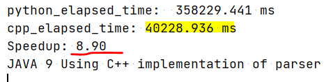
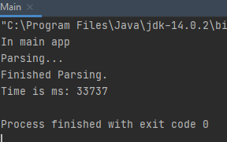

# Speedy module

Thanks to Speedy Antlr Tool, CodART is now using C++ in the backend to parse JAVA source codes. 
To use the speedy module, named `java9speedy` first, you must build and install `java9speedy` module using:

`python setup.py install` with the right privileges.

On windows  >= MVC++11 is required.

## Parse tree creation time

For the `/grammars/Test.java` the following parsing times are observed on a Windows machine with Intel CORE i7:

Please open an issue in case of any problem.
Thanks, Morteza